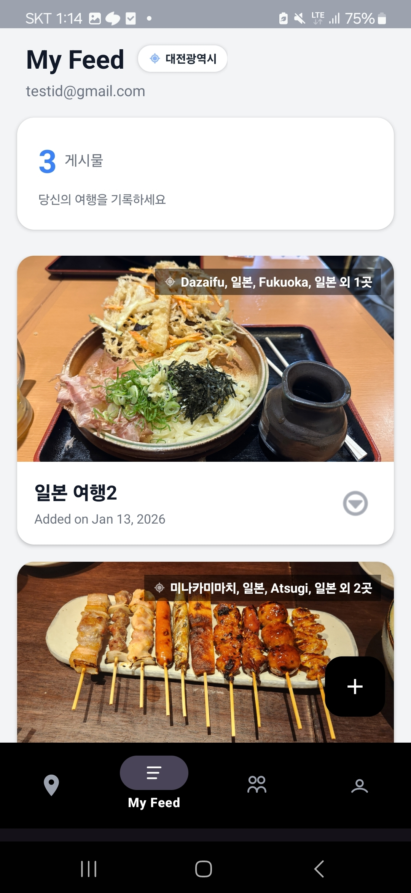
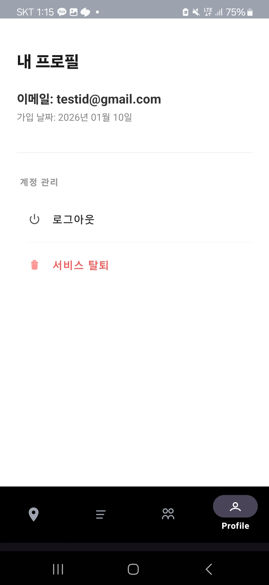
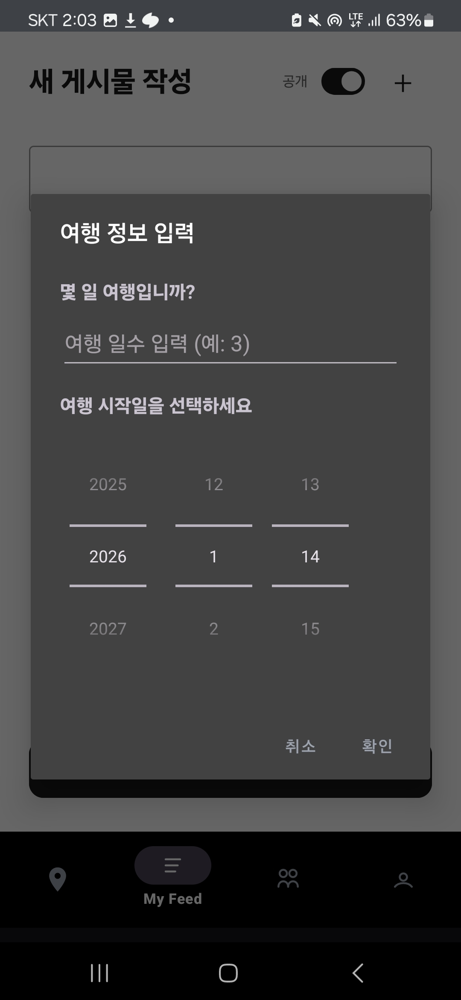

# PinLog (핀로그)

당신의 여행을 기록하고 공유하세요

### 👥 기여자
<!-- readme: contributors -start -->
<table>
	<tbody>
		<tr>
            <td align="center">
                <a href="https://github.com/robinhood0107">
                    
                    <br />
                    <sub><b>robinhood0107</b></sub>
                </a>
            </td>
            <td align="center">
                <a href="https://github.com/jongjm1023">
                    
                    <br />
                    <sub><b>jongjm1023</b></sub>
                </a>
            </td>
		</tr>
	<tbody>
</table>
<!-- readme: contributors -end -->

**robinhood0107**: UI/UX 디자인 • Firebase DB/Storage • 게시판(Feed) 및 리스트 탭 • 상세 페이지 • 이미지 전체화면 • 글 작성/수정 • 이미지 압축/썸네일 • 지오코딩

**jongjm1023**: UI/UX 디자인 • 지도(Map) 기능 • Firebase DB/Storage • 로그인 • EXIF 위치 추출 • 역지오코딩 • 검색 기능 • 마이 페이지

</img>

### ✨ 소개
PinLog는 여행 기록을 지도에 핀으로 남기고 공유할 수 있는 위치 기반 여행 기록 앱입니다. 여행 중 찍은 사진과 함께 위치 정보를 저장하고, 지도에서 여행 경로를 시각적으로 확인할 수 있습니다. 다른 사람들의 여행 기록을 탐색하고 영감을 얻을 수도 있습니다.

### 🚀 기술 스택


#### 런타임 / 빌드 환경
- **언어 / SDK**
  - **Java 11** (sourceCompatibility / targetCompatibility)
  - **Android SDK**: `minSdk 24`, `targetSdk 36`, `compileSdk 36`
- **Gradle / Android Gradle Plugin**
  - Gradle Wrapper + **AGP 8.13.2**
  - `com.google.gms.google-services` 플러그인
  - `com.google.android.libraries.mapsplatform.secrets-gradle-plugin` (Google Maps API 키 관리)

#### 앱 구조 / 아키텍처
- **Single-Activity, Multi-Fragment 구조**
  - `MainActivity` + `BottomNavigationView` 로 **My Feed / Community / Map / Profile** 탭 전환
  - `DetailFragment`, `FullScreenImageFragment`, `WriteFragment` 등은 백스택을 이용한 화면 전환
- **UI 구성요소**
  - `RecyclerView` + `PostAdapter` / `HeroPostAdapter` / `DetailAdapter` / `PhotoAdapter`
  - `ViewPager2` 기반 Hero 카드 슬라이더
  - `FloatingActionButton`, `MaterialButton`, `TextInputLayout`, `MaterialSwitch` 등 Material 컴포넌트 사용
  - `CardView`, 커스텀 `SquareImageView`를 이용한 카드형 레이아웃

#### 주요 라이브러리
- **Firebase**
  - **Firebase Authentication** (`firebase-auth`): 이메일/비밀번호 로그인, Google 로그인, 재인증 및 회원 탈퇴
  - **Cloud Firestore** (`firebase-firestore`): 여행 기록(`TravelPosts`) CRUD, 공개/비공개, 검색용 도시/국가 필드 저장
  - **Firebase Storage** (`firebase-storage`): 원본 이미지 및 썸네일 업로드/삭제
  - **Firebase Realtime Database** (`firebase-database`): 프로젝트에 의존성 존재 (확장용)
  - **Firebase Analytics** (`firebase-analytics`): 앱 사용 분석 이벤트 수집
  - **Firebase App Check Debug** (`firebase-appcheck-debug`): 개발 환경 App Check
- **Google Play Services / Maps**
  - **Google Sign-In** (`play-services-auth`): Google 계정 로그인
  - **Google Maps SDK** (`play-services-maps`): 지도 표시
  - **Fused Location Provider** (`play-services-location`): 현재 위치 조회
  - **Android Maps Utils** (`android-maps-utils`): 마커 클러스터링(`ClusterManager`, 커스텀 `PhotoRenderer`)
- **지도 / 위치 / EXIF**
  - `ExifInterface`: 사진 EXIF 메타데이터(촬영 일시, 위도·경도) 파싱
  - `Geocoder`: 역지오코딩(위도·경도 → 주소, 도시/국가명 추출), 위치명 → 좌표 지오코딩
- **UI / 이미지**
  - **Glide** (`com.github.bumptech.glide:glide:4.16.0`): 이미지 로딩 및 캐싱, 지도 마커 썸네일 로딩
  - **PhotoView** (`com.github.chrisbanes:PhotoView:2.3.0`): 전체 화면 이미지 확대/축소 제스처
  - **AndroidX AppCompat / Material / Activity / ConstraintLayout / CardView**: 전반적인 UI 구성
- **테스트**
  - **JUnit4**, **AndroidX Test JUnit**, **Espresso**: 단위/계측 테스트 의존성

### 📌 주요 기능

- **여행 기록 작성**
  - 여행 **시작일·여행 일수(박/일)** 선택 다이얼로그
  - 사진 EXIF 촬영 일시를 기반으로 **여행 기간 밖 사진 자동 필터링**
  - 여행 일차(Day)를 계산해 각 사진에 매핑하고, **일차 + 시간 순 정렬**
  - 사진별 **일자/시간·위치 수동 수정**, 위치명 입력 시 지오코딩으로 좌표/주소 갱신
  - 사진 **드래그 앤 드롭 재정렬**, 개별 삭제/편집
  - 업로드 시 원본 이미지 + **썸네일 자동 생성 및 Firebase Storage 업로드**
  - 게시글 공개/비공개 토글 (MaterialSwitch, 색상 피드백 포함)
- **My Feed (내 피드)**
  - 로그인한 사용자의 이메일(`userEmail`) 기준으로 **본인 게시글만 필터링**
  - 무한 스크롤(페이지네이션) 로딩
  - 상단 프로필 카드에 **이메일, 작성한 핀 개수, 현재 위치 배지(iOS 스타일)** 표시
  - 현재 위치는 Fused Location + Geocoder로 도시/국가명 추출
  - 게시글 롱클릭 시 **수정 / 삭제 컨텍스트 메뉴**, 삭제 시 Storage 원본·썸네일까지 함께 정리
- **Community (공개 피드)**
  - 공개(`isPublic = true`)된 게시글을 **Hero 이미지 슬라이더(ViewPager2)** 로 탐색
  - `createdAt` 기준 **최신순 / 오래된순 정렬** 토글
  - 도시/국가명을 대상으로 한 **클라이언트 사이드 검색**
    - Firestore에서 공개 게시물 전체를 가져와 `cities`, `countries` 배열에 대해 소문자 포함 매칭
  - Hero 카드 인디케이터(최대 개수 제한) + 좌우 이동 버튼
  - 게시글 롱클릭 시 **소유자에게만 수정/삭제 메뉴 노출**, 삭제 시 Storage 이미지·썸네일 삭제 포함
- **지도(Map) 탐색**
  - 내 게시글의 `imageLatitudes`, `imageLongitudes`, `images`를 기반으로 **각 사진을 개별 마커로 표시**
  - `ClusterManager` + 커스텀 `PhotoRenderer` 로 **사진 썸네일 기반 마커 클러스터링**
  - 개별 마커 클릭 시 해당 게시글 상세 보기로 이동
  - 클러스터 클릭 시 확대 대신 **첫 번째 아이템 게시글로 바로 이동**하도록 UX 커스터마이징
- **상세 페이지**
  - 게시글의 사진을 **일차 헤더 + 사진 그리드 + 푸터** 형태로 표시
  - SeekBar를 통해 **열 개수(1~N열) 동적 조절**, 열이 많아질수록 헤더/푸터 레이아웃을 최적화
  - 사진 탭 시 `FullScreenImageFragment`로 이동하여 전체 화면 확대/축소
- **프로필 (마이 페이지)**
  - 이메일, 가입일 표기 (Firebase Auth `UserMetadata.creationTimestamp`)
  - **로그아웃**: FirebaseAuth 세션 종료 후 로그인 화면으로 이동
  - **회원 탈퇴**: 이메일·비밀번호 재인증 후 계정 삭제, 완료 시 세션 정리 및 로그인 화면 이동
- **이미지 전체 화면**
  - `PhotoView` 기반 핀치 줌/더블 탭 확대/이동
  - Glide로 고해상도 이미지 로딩
  - 상단 닫기 버튼으로 백스택 팝 → 이전 화면으로 자연스럽게 복귀

### 📍 자세한 기능

#### 인증 및 사용자 관리
- **Google 로그인**: Google 계정을 통한 간편 로그인
- **이메일 회원가입/로그인**: 이메일과 비밀번호를 통한 회원가입 및 로그인
- **자동 로그인**: Firebase Auth를 통한 세션 관리 (앱 재시작 시 자동 로그인)
- **회원 탈퇴**: 비밀번호 재인증 후 계정 삭제

#### 여행 기록 관리
- **글 작성**: 여행 제목, 일정(시작일, 여행 일수), 사진, 위치 정보를 포함한 기록 작성
- **글 수정**: 작성한 여행 기록을 수정할 수 있습니다
- **글 삭제**: 자신이 작성한 기록을 삭제할 수 있습니다
- **공개/비공개 설정**: 여행 기록을 SNS 게시판으로의 공개 또는 비공개로 설정할 수 있습니다

#### 위치 기반 기능
- **EXIF 위치 추출**: 사진의 EXIF 데이터에서 위치 정보 자동 추출
- **지도 마커**: 각 여행 기록의 위치를 지도에 해당 사진의 썸네일 마커로 표시
- **클러스터링**: 가까운 위치의 마커를 자동으로 클러스터링하여 효율적으로 표시
- **역지오코딩**: 좌표를 주소로 변환하여 표시

#### 이미지 관리
- **다중 이미지 업로드**: 여러 장의 사진을 한 번에 선택하여 업로드
- **이미지 압축**: 업로드 전 이미지를 자동으로 압축하여 저장 공간 절약
- **이미지 회전 처리**: 가로사진과 세로사진에 대해 EXIF 방향 정보를 읽어 올바른 방향으로 표시
- **썸네일 생성**: 지도 마커용 썸네일 자동 생성
- **Glide를 통한 이미지 로딩**: 효율적인 이미지 로딩 및 캐싱

#### UI/UX
- **무한 스크롤**: 글 목록을 무한 스크롤로 불러오기
- **그리드 레이아웃**: 상세 페이지에서 사진을 그리드 형태로 탐색 (열 개수 조절 가능)
- **Hero 이미지**: Community 탭에서 주요 이미지를 ViewPager로 크게 표시
- **검색 기능**: Community 탭에서 도시/국가명으로 여행 기록 검색
- **다크 모드 지원**: 시스템 설정에 따른 라이트 모드, 다크 모드 지원
- **Material Design 3**: Material 3 테마 적용 (테마는 Material 3, 위젯은 Material Components 사용)

### 🛠️ 설치 및 실행 방법

#### 전제 조건
- Android Studio
- JDK 11 이상
- Android SDK (API 24 이상)
- Google Maps API 키
- Firebase 프로젝트 설정
  - `google-services.json` 파일 필요
  - Firebase Authentication 활성화
  - Firestore Database 설정
  - Firebase Storage 설정

#### 프로젝트 설정

1. **프로젝트 클론**
```bash
git clone https://github.com/reproducepark/madcamp01.git
cd madcamp01
```

2. **Google Maps API 키 설정**
   - `local.properties` 파일에 Google Maps API 키 추가:
   ```
   MAPS_API_KEY=YOUR_API_KEY_HERE
   ```

3. **Firebase 설정**
   - Firebase Console에서 프로젝트 생성
   - `google-services.json` 파일을 `app/` 디렉토리에 배치
   - Firebase Authentication에서 이메일/비밀번호 및 Google 로그인 활성화
   - Firestore Database 생성
   - Firebase Storage 설정

4. **프로젝트 빌드**
```bash
# Windows
.\gradlew.bat assembleDebug

# macOS/Linux
./gradlew assembleDebug
```

5. **APK 설치**
   - 빌드된 APK 파일은 `app/build/outputs/apk/debug/app-debug.apk`에 생성됩니다
   - Android 기기에 설치하여 실행

#### 개발 환경 설정
- Android Studio에서 프로젝트 열기
- Gradle 동기화
- 에뮬레이터 또는 실제 기기에서 실행

### 📱 주요 화면

- **스플래시 화면**: 앱 시작 시 표시

- **로그인 화면**: Google 로그인 및 이메일 회원가입/로그인  
  

- **메인 화면**: 하단 네비게이션 바를 통한 화면 전환
  - **My Feed 탭**: 본인이 작성한 여행 기록 목록 (무한 스크롤, 본인 글만 표시)

    <video src="./movie/myfeed.mp4" width="360" controls muted></video>  
    

  - **Community 탭**: 공개된 여행 기록을 Hero 이미지 형태로 탐색 (검색 및 정렬 기능 포함)

    <video src="./movie/community.mp4" width="360" controls muted></video>

  - **Map 탭**: 본인이 작성한 여행 기록의 위치를 지도에 썸네일 마커로 표시

    <video src="./movie/map.mp4" width="360" controls muted></video>

  - **Profile 탭**: 사용자 정보 확인, 로그아웃, 회원 탈퇴  
    

- **글 작성 화면**: 여행 기록 작성 및 수정 (공개/비공개 설정 가능), 게시물의 위치와 시간변경도 가능


    
  

- **상세 화면**: 여행 기록 상세 정보 및 사진 그리드
- **이미지 전체 화면**: 사진 확대 보기

### 🔐 권한 요청

앱은 다음 권한을 요청합니다:
- **인터넷**: Firebase 및 Google Maps API 사용
- **위치 정보** (ACCESS_FINE_LOCATION, ACCESS_COARSE_LOCATION): 현재 위치 기반 기능
- **저장소 접근** (READ_EXTERNAL_STORAGE, READ_MEDIA_IMAGES, READ_MEDIA_VIDEO): 사진 선택 및 업로드
- **미디어 위치 정보** (ACCESS_MEDIA_LOCATION): 사진의 EXIF 데이터에서 위치 정보 추출

---

**PinLog** - 당신의 여행을 기록하고 공유하세요 ✈️
